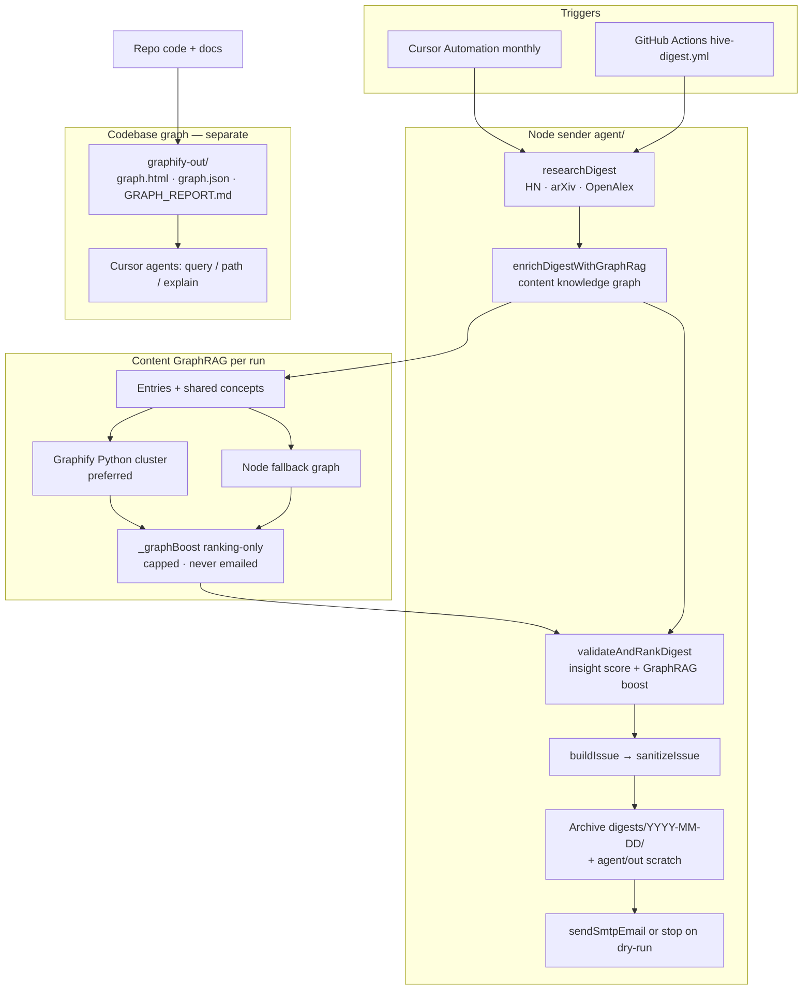

# Hive Digest — Synbrains

Generates a changelog-style **Hive Digest** for [hive.synbrains.ai](https://hive.synbrains.ai/):
new/updated AI models, algorithms & systems techniques, and company product
releases — each pulled live from the web, validated, ranked by insight value,
and written up with a source link.

Brand: **Hive by Synbrains** (accents `#EE462F` → `#7610C7`).

**Architecture:** see [`docs/ARCHITECTURE.md`](docs/ARCHITECTURE.md) for the
overall system design, pipeline flowchart, and how Graphify is integrated
(codebase map + content GraphRAG).

## Naming (read this first)

| Name | Meaning |
| --- | --- |
| **Hive Digest** | Product / emailed or exported issue |
| **Hive by Synbrains** | Brand line |
| **hive.synbrains.ai** | Product site |
| **ark-synbrains/hive-digest** | This GitHub repository |
| **`hive-digest.html`** | Claude.ai browser artifact UI |
| **`agent/`** (`hive-digest-agent`) | Node sender: research → validate/rank → SMTP (not a Cursor Cloud Agent) |
| **`NEWSLETTER_TO_EMAILS`** | Recipient-list env/secret (historical name; product is still Hive Digest) |
| **`.github/workflows/hive-digest.yml`** | Monthly GitHub Actions send |
| **`.cursor/automations/hive-digest.md`** | Cursor Automation recipe for the same monthly send |
| **Former names (do not use)** | `tech-digest-agent.html`, repo `ark-synbrains/dev-digest`, subject `/dev/digest` |

---

## Features

- **Live generation** — pulls current developments across three lanes:
  *models & research*, *algorithms & systems*, and *product & company
  releases*.
- **Validation & insight ranking** — each entry is schema-validated, then
  scored for engineer understanding. Higher-scoring stories appear first;
  weaker sections sort last. **Scores are never shown** in the emailed or
  exported issue.
- **Scoped runs** — narrow a run to just one lane in the HTML tool.
- **Retry & timeout handling** — every upstream (HN, arXiv, OpenAlex, and
  the HTML tool’s Anthropic calls) retries transient 429/408/5xx with
  backoff. The Node sender paces per host, times out hung requests, falls
  back across sources (arXiv→OpenAlex→HN; alternate HN queries per lane),
  and soft-fails individual queries so one rate-limit cannot abort the digest.
- **Hive branding** — dark UI with Synbrains red→purple gradient accents,
  matching [hive.synbrains.ai](https://hive.synbrains.ai/).
- **Download the issue** — export Markdown or standalone dark HTML
  (`Hive Digest` branding).
- **Responsive layout** — usable from phone to desktop.
- **Knowledge graph** — [graphify](https://github.com/Graphify-Labs/graphify) maps the
  codebase (AST + docs) into a queryable graph under `graphify-out/`, and the
  Node sender also builds a **content GraphRAG** graph from each run’s research
  candidates to boost insight ranking (see below).

## How to use it

1. Open `hive-digest.html` inside a Claude.ai artifact (see
   **Important: where this runs**, below).
2. Optionally narrow the scope with the dropdown.
3. Click **generate Hive Digest**. Lanes fill in as they complete; entries
   are ranked by insight score (scores stay hidden).
4. Download `.md` or `.html` when ready. HTML exports always use the dark
   Hive theme.

## Knowledge graph (graphify)

This repo includes a checked-in [graphify](https://github.com/Graphify-Labs/graphify)
knowledge graph of the sender, automations, and docs.

Artifacts:
- [`graphify-out/graph.html`](graphify-out/graph.html) — interactive graph (open the file in a browser after cloning locally)
- [`graphify-out/graph.json`](graphify-out/graph.json) — queryable graph data
- [`graphify-out/GRAPH_REPORT.md`](graphify-out/GRAPH_REPORT.md) — communities, god nodes, suggested questions

### Skill setup (once per machine)

```bash
# CLI (PyPI package name is temporarily graphifyy)
uv tool install graphifyy   # or: pipx install graphifyy

# Project-scoped Cursor rule + Agent Skills skill (committed in this repo)
graphify install --platform cursor --project
graphify install --platform agents --project

# Optional: keep graph.json current + conflict-safe on commits
graphify hook install
```

This repo already includes:
- `.cursor/rules/graphify.mdc` — always-on Cursor rule (query-first)
- `.agents/skills/graphify/` — `/graphify` Agent Skill + references
- `.graphifyignore` — excludes skill/rule artifacts from the generated graph
- `.gitattributes` — union-merge driver for `graphify-out/graph.json`

### Rebuild / query

```bash
# AST-only refresh after code changes (no LLM)
graphify update .

# full rebuild in Cursor / Claude
/graphify .

# query the existing graph
graphify query "how does research fall back across sources?"
graphify path "researchDigest" "sendSmtpEmail"
graphify explain "fetchWithRetry"
```

### Rebuild on code changes (CI)

[`.github/workflows/graphify.yml`](.github/workflows/graphify.yml) runs
`graphify update . --force` on pushes to `main` that touch code
(`agent/**`, `hive-digest.html`, and common source extensions), then
commits refreshed `graphify-out/` artifacts when the graph changes.
Manual runs: Actions → **graphify** → **Run workflow**.

### Architecture flowchart

> Full write-up: [`docs/ARCHITECTURE.md`](docs/ARCHITECTURE.md)

Two Graphify roles sit around the product: a **codebase map** for agents/humans,
and a **content GraphRAG** step inside each monthly send.



### Content GraphRAG (inside the monthly digest pipeline)

Separate from the **codebase** map above, the Node sender (`agent/`) builds a
**content** knowledge graph from research candidates each run:

```
researchDigest → enrichDigestWithGraphRag → validateAndRankDigest → render → SMTP
```

How it works:

1. Research pulls HN / arXiv / OpenAlex candidates into three lanes.
2. `agent/src/graphrag.mjs` turns entries into Graphify extraction nodes
   (documents) plus shared technical **concepts**, lane tags, and source hosts.
3. Prefer `agent/scripts/build_content_graph.py` (Graphify + NetworkX) to
   cluster and compute god-node / bridge **ranking boosts** (`_graphBoost`).
4. If Python/graphifyy is missing, a pure-Node fallback computes the same style
   of boosts so the digest never fails on GraphRAG.
5. `scoreInsight()` applies the boost (capped at +12). Boosts are ranking-only
   and never appear in the emailed issue.

Artifacts (gitignored) land under `agent/out/digest-graph/<date>/`:
`extraction.json`, `graph.json`, `boosts.json`, `corpus/`, `summary.json`.

| Env | Effect |
| --- | --- |
| `HIVE_GRAPHRAG=0` | Disable content GraphRAG (research → validate only) |
| `HIVE_GRAPHRAG_FORCE_NODE=1` | Skip Python; use Node fallback boosts |
| `GRAPHIFY_PYTHON` | Optional path to the Python that has `graphify` installed |

This does **not** replace live research, and it does **not** write into
`graphify-out/` (that remains the codebase map for Cursor agents).

## Important: where this runs

This tool calls `https://api.anthropic.com/v1/messages` directly from the
browser, with Claude's web search tool enabled. That request only succeeds
inside a Claude.ai artifact (or another Claude surface that provides the same
proxy).

**Opening this file directly in a plain browser will not work** — there's no
API key configured client-side.

## Customizing

**Colors** — Hive tokens live in `:root` (`--hive-red`, `--hive-purple`, …).
Email/export palettes are `HIVE` in `agent/src/render.mjs` and
`HIVE_DIGEST_DARK` in `hive-digest.html` (keep them aligned).

**Insight ranking** — `agent/src/validate.mjs` (`validateAndRankDigest`) for
the Node sender; mirrored client-side in `hive-digest.html`.

**Category focus / prompts** — `categoryPrompt(cat, today)` in the HTML
`<script>` block.

## Scheduled Hive Digest (automation)

Two ways to generate and email Hive Digest on a timer:

1. **Cursor Automation (preferred)** — paste
   [`.cursor/automations/hive-digest.md`](.cursor/automations/hive-digest.md)
   at [cursor.com/automations](https://cursor.com/automations), on the **1st of
   each month at 09:00 IST** (`CRON_TZ=Asia/Kolkata 0 9 1 * *`).
2. **GitHub Actions fallback** —
   [`.github/workflows/hive-digest.yml`](.github/workflows/hive-digest.yml)
   runs `agent/` on the **1st of each month at 09:00 IST** (`30 3 1 * *` UTC).

Merged PR feature branches are deleted automatically by
[`.github/workflows/delete-merged-branch.yml`](.github/workflows/delete-merged-branch.yml)
(same-repo heads only; `main`/`master` are never deleted).

### Node sender CLI (`agent/`)

```bash
npm install --prefix agent
# preview only (writes digests/YYYY-MM-DD/ + agent/out/)
npm run generate --prefix agent
# send for real (needs SMTP secrets below; also archives under digests/)
npm start --prefix agent
```

Secrets (Cursor environment and/or GitHub Actions):

- `SMTP_HOST`
- `SMTP_PORT` (e.g. `587`)
- `SMTP_USER`
- `SMTP_PASS`
- `SMTP_FROM` (e.g. `Hive Digest <news@example.com>`)
- `NEWSLETTER_TO_EMAILS` — recipient list (historical env name)

Optional: `SMTP_SECURE`, `SMTP_REPLY_TO`

## File structure

```
hive-digest.html                    Claude.ai browser artifact UI
digests/                            tracked archive of generated issues
  YYYY-MM-DD/                       hive-digest.html/.txt + ranking/meta JSON
agent/                              Node sender (npm: hive-digest-agent)
  package.json                      package name hive-digest-agent
  src/run.mjs                       orchestration + GraphRAG + archive + SMTP
  src/research.mjs                  HN + arXiv research (OpenAlex / HN fallback)
  src/graphrag.mjs                  content GraphRAG → ranking boosts
  src/validate.mjs                  schema validation + insight scoring
  src/render.mjs                    Hive Digest email HTML (dark; HIVE palette)
  src/sanitize.mjs                  sanitizeDigestText / sanitizeIssue
  src/smtp.mjs                      nodemailer transport
  scripts/build_content_graph.py    Graphify build/cluster for content boosts
  out/                              local scratch copies (gitignored)
graphify-out/                       codebase knowledge graph (graphify)
  graph.html                        interactive visualization
  graph.json                        queryable graph data
  GRAPH_REPORT.md                   communities / god nodes / questions
.agents/skills/graphify/            /graphify Agent Skill + references
.graphifyignore                     exclude skill/rule/digest files from the graph
.github/workflows/hive-digest.yml   monthly SMTP send + commit digests/
.github/workflows/graphify.yml      rebuild graphify-out on code pushes
.cursor/automations/hive-digest.md  Cursor Automation recipe (monthly send)
.cursor/rules/graphify.mdc          always-on Cursor graphify rule
.gitattributes                      graph.json union-merge driver
docs/ARCHITECTURE.md                system architecture + Graphify integration
README.md
```
