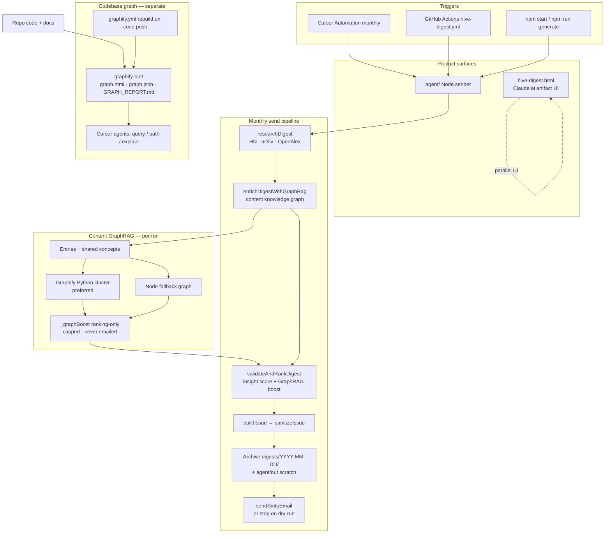
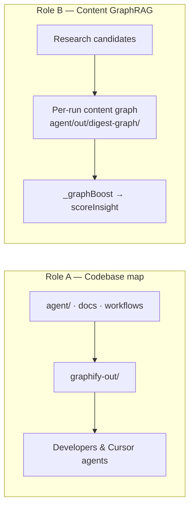

# Hive Digest — Architecture & Graphify Integration

This document explains how **Hive Digest** is put together, how a monthly issue
is produced and emailed, and how **[Graphify](https://github.com/Graphify-Labs/graphify)**
is used in two different roles: a **codebase knowledge map** for humans/agents,
and **content GraphRAG** inside the newsletter pipeline.

Product: [hive.synbrains.ai](https://hive.synbrains.ai/) · Brand: **Hive by Synbrains**  
Repo: [ark-synbrains/hive-digest](https://github.com/ark-synbrains/hive-digest)

---

## 1. What the system does (plain English)

Hive Digest is an automated newsletter that:

1. **Finds** current AI/tech stories from the web (Hacker News, arXiv, OpenAlex).
2. **Maps how those stories relate** (content GraphRAG via Graphify).
3. **Scores and ranks** them for engineer insight (scores never appear in the email).
4. **Builds** a dark, branded HTML/text issue.
5. **Archives** the issue under `digests/YYYY-MM-DD/` in this repository.
6. **Emails** it over SMTP (or stops after archive on `--dry-run`).

There are two ways people interact with the product:

| Surface | Role |
| --- | --- |
| `hive-digest.html` | Claude.ai browser artifact UI (interactive generate/export) |
| `agent/` (`hive-digest-agent`) | Scheduled Node CLI: research → GraphRAG → rank → archive → SMTP |

Monthly automation can run via **Cursor Automation** (preferred) or **GitHub Actions**
(`.github/workflows/hive-digest.yml`) as a fallback.

---

## 2. Overall architecture flowchart



### Pipeline in one line

```
research → content GraphRAG → validate/rank → render/sanitize → archive digests/ → SMTP
```

---

## 3. Module map (Node sender)

| Module | Responsibility |
| --- | --- |
| `agent/src/run.mjs` | Orchestration, archive, SMTP (or dry-run) |
| `agent/src/research.mjs` | Live research with retries, pacing, fallbacks |
| `agent/src/graphrag.mjs` | Build content graph + attach `_graphBoost` |
| `agent/scripts/build_content_graph.py` | Graphify build/cluster → boost JSON |
| `agent/src/validate.mjs` | Schema checks + insight scoring/ranking |
| `agent/src/render.mjs` | Branded HTML/text issue (`HIVE` palette) |
| `agent/src/sanitize.mjs` | Clean glyphs/HTML for email clients |
| `agent/src/smtp.mjs` | nodemailer transport |
| `digests/YYYY-MM-DD/` | Tracked archive of each generated issue |
| `graphify-out/` | Checked-in **codebase** knowledge graph |

Research lanes (after ranking, typically ~3 entries each):

1. **models** — models & research  
2. **algorithm** — algorithms & systems  
3. **product** — product & company releases  

---

## 4. How Graphify is integrated

Graphify is used in **two places**. They share the Graphify toolkit but **do not
share the same graph files**.



### Role A — Codebase knowledge graph (developer / agent tooling)

**Purpose:** Help humans and Cursor agents understand *this repository* without
reading every file.

| Piece | Location |
| --- | --- |
| Interactive viz | [`graphify-out/graph.html`](../graphify-out/graph.html) |
| Queryable data | [`graphify-out/graph.json`](../graphify-out/graph.json) |
| Plain-language report | [`graphify-out/GRAPH_REPORT.md`](../graphify-out/GRAPH_REPORT.md) |
| Always-on Cursor rule | [`.cursor/rules/graphify.mdc`](../.cursor/rules/graphify.mdc) |
| Agent Skill | [`.agents/skills/graphify/`](../.agents/skills/graphify/) |
| Ignore skill/digest noise | [`.graphifyignore`](../.graphifyignore) |
| CI rebuild | [`.github/workflows/graphify.yml`](../.github/workflows/graphify.yml) |

**Typical use:**

```bash
graphify query "how does research fall back across sources?"
graphify path "researchDigest" "sendSmtpEmail"
graphify explain "fetchWithRetry"
graphify update .          # AST-only refresh after code changes
```

This graph is **not** consulted when choosing newsletter stories.

### Role B — Content GraphRAG (inside the monthly digest)

**Purpose:** After research gathers candidates, build a short-lived **content**
knowledge graph of *those stories* and use it to slightly improve ranking.

**Flow:**

1. `researchDigest()` returns lane candidates (headlines, summaries, URLs).
2. `enrichDigestWithGraphRag()` in `agent/src/graphrag.mjs`:
   - Turns each entry into a document node.
   - Extracts shared technical **concepts**, lane tags, and source hosts.
   - Links entries that share concepts (relatedness bridges).
3. Preferred engine: `agent/scripts/build_content_graph.py`  
   (Graphify + NetworkX: cluster, god nodes → ranking boosts).
4. Fallback: pure Node graph if Python/`graphifyy` is missing — the send never
   fails because of GraphRAG.
5. `scoreInsight()` applies `_graphBoost` (capped at **+12**).  
   Boosts are **ranking-only** and are stripped before the email is built.
6. Artifacts for the run (gitignored) land under  
   `agent/out/digest-graph/<date>/` (`extraction.json`, `graph.json`, `boosts.json`, …).

**Controls:**

| Env | Effect |
| --- | --- |
| `HIVE_GRAPHRAG=0` | Skip content GraphRAG entirely |
| `HIVE_GRAPHRAG_FORCE_NODE=1` | Force Node fallback (skip Python) |
| `GRAPHIFY_PYTHON` | Python interpreter that has `graphify` installed |

**What content GraphRAG does *not* do:**

- It does not replace live HN / arXiv / OpenAlex research.
- It does not write into `graphify-out/` (codebase map stays separate).
- It does not put scores or GraphRAG metadata in the emailed issue.
- It does not require an LLM for the monthly path (structural graph + clustering).

---

## 5. Issue archive

Every dry-run (`npm run generate`) and live send (`npm start`) writes:

```
digests/YYYY-MM-DD/
  hive-digest.html
  hive-digest.txt
  ranking.json
  graphrag.json
  meta.json
```

Scratch copies also go to `agent/out/` (gitignored).  
The monthly GitHub Actions workflow commits new `digests/` folders after a
successful send. See [`digests/README.md`](../digests/README.md).

---

## 6. Trust boundaries & secrets

| Concern | Approach |
| --- | --- |
| Email delivery | SMTP via `SMTP_*` + `NEWSLETTER_TO_EMAILS` (historical env name) |
| Upstream APIs | Retries, per-host pacing, circuit breaker, soft-fail per query |
| Ranking privacy | Insight / GraphRAG scores logged only — never in subject/body |
| Codebase vs content | Separate graphs; `.graphifyignore` keeps digests/skills out of code graph |
| Browser UI | `hive-digest.html` needs Claude.ai artifact proxy for Anthropic calls |

---

## 7. Related docs

| Doc | Contents |
| --- | --- |
| [README.md](../README.md) | Product overview, setup, flowchart summary |
| [agent/README.md](../agent/README.md) | Node sender commands and module table |
| [digests/README.md](../digests/README.md) | Issue archive layout |
| [graphify-out/GRAPH_REPORT.md](../graphify-out/GRAPH_REPORT.md) | Latest codebase graph communities / hubs |
| [`.cursor/automations/hive-digest.md`](../.cursor/automations/hive-digest.md) | Cursor Automation recipe |

---

## 8. Mental model (one paragraph)

Think of Hive Digest as a **research → rank → publish** factory. Graphify sits
beside that factory as a **map of the factory’s code** (for builders), and also
steps into the line briefly after research to **map how this month’s stories
relate**, nudging ranking without changing how stories are fetched or how the
email looks. Finished issues are stored in `digests/` so every run leaves a
durable record in the repository.
